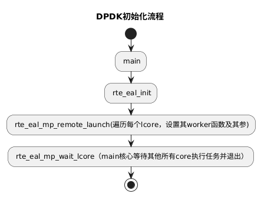

# 解读DPDK源码，仅用于个人学习交流使用

# extension_tools目录
> [!note]
> 为了不真正编译目录，但是可以为clangd生成compile_commands.json文件，在此目录下增加了一个Python脚本gen_compile_commands.py，可以完成这个需求

# DPDK初始化流程

### 初始化流程图

流程图如下：



`plantuml`代码

```shell
@startuml
title DPDK初始化流程
start

: main;
: rte_eal_init;
: rte_eal_mp_remote_launch(遍历每个lcore，设置其worker函数及其参);
: rte_eal_mp_wait_lcore（main核心等待其他所有core执行任务并退出）;

stop
@enduml
```

## 初始化流程

1. `main core`调用`rte_eal_init`进行环境初始化
   1. 设置`memory`，创建其他逻辑核的工作线程
   2. 设置日志等等（后续再继续解读一下）
2. 调用`rte_eal_mp_remote_launch`给每个逻辑核设置工作函数
   1. 注意，此操作在`rte_eal_init`后面才能进行，因为在`rte_eal_init`中才能创建线程

# 环境抽象层初始化函数注释

```c
* Launch threads, called at application init(). */
int
rte_eal_init(int argc, char **argv)
{
	int i, fctret, ret;
	static uint32_t run_once;
	uint32_t has_run = 0;
	char cpuset[RTE_CPU_AFFINITY_STR_LEN];
	char thread_name[RTE_THREAD_NAME_SIZE];
	const struct rte_config *config = rte_eal_get_configuration();
	struct internal_config *internal_conf =
		eal_get_internal_configuration();
	bool has_phys_addr;
	enum rte_iova_mode iova_mode;

	/* setup log as early as possible */
	if (eal_parse_log_options(argc, argv) < 0) {
		rte_eal_init_alert("invalid log arguments.");
		rte_errno = EINVAL;
		return -1;
	}

	eal_log_init(getprogname());

	/* checks if the machine is adequate */
	if (!rte_cpu_is_supported()) {
		rte_eal_init_alert("unsupported cpu type.");
		rte_errno = ENOTSUP;
		return -1;
	}

	/* verify if DPDK supported on architecture MMU */
	if (!eal_mmu_supported()) {
		rte_eal_init_alert("unsupported MMU type.");
		rte_errno = ENOTSUP;
		return -1;
	}

	if (!rte_atomic_compare_exchange_strong_explicit(&run_once, &has_run, 1,
					rte_memory_order_relaxed, rte_memory_order_relaxed)) {
		rte_eal_init_alert("already called initialization.");
		rte_errno = EALREADY;
		return -1;
	}

	eal_reset_internal_config(internal_conf);

	/* clone argv to report out later in telemetry */
	eal_save_args(argc, argv);

	if (rte_eal_cpu_init() < 0) {
		rte_eal_init_alert("Cannot detect lcores.");
		rte_errno = ENOTSUP;
		return -1;
	}

	fctret = eal_parse_args(argc, argv);
	if (fctret < 0) {
		rte_eal_init_alert("Invalid 'command line' arguments.");
		rte_errno = EINVAL;
		rte_atomic_store_explicit(&run_once, 0, rte_memory_order_relaxed);
		return -1;
	}

	/* FreeBSD always uses legacy memory model */
	internal_conf->legacy_mem = true;
	if (internal_conf->in_memory) {
		EAL_LOG(WARNING, "Warning: ignoring unsupported flag, '%s'",
			OPT_IN_MEMORY);
		internal_conf->in_memory = false;
	}

	if (eal_plugins_init() < 0) {
		rte_eal_init_alert("Cannot init plugins");
		rte_errno = EINVAL;
		rte_atomic_store_explicit(&run_once, 0, rte_memory_order_relaxed);
		return -1;
	}

	if (eal_trace_init() < 0) {
		rte_eal_init_alert("Cannot init trace");
		rte_errno = EFAULT;
		rte_atomic_store_explicit(&run_once, 0, rte_memory_order_relaxed);
		return -1;
	}

	if (eal_option_device_parse()) {
		rte_errno = ENODEV;
		rte_atomic_store_explicit(&run_once, 0, rte_memory_order_relaxed);
		return -1;
	}

	if (rte_config_init() < 0) {
		rte_eal_init_alert("Cannot init config");
		return -1;
	}

	if (rte_eal_intr_init() < 0) {
		rte_eal_init_alert("Cannot init interrupt-handling thread");
		return -1;
	}

	if (rte_eal_alarm_init() < 0) {
		rte_eal_init_alert("Cannot init alarm");
		/* rte_eal_alarm_init sets rte_errno on failure. */
		return -1;
	}

	/* Put mp channel init before bus scan so that we can init the vdev
	 * bus through mp channel in the secondary process before the bus scan.
	 */
	if (rte_mp_channel_init() < 0 && rte_errno != ENOTSUP) {
		rte_eal_init_alert("failed to init mp channel");
		if (rte_eal_process_type() == RTE_PROC_PRIMARY) {
			rte_errno = EFAULT;
			return -1;
		}
	}

	if (rte_bus_scan()) {
		rte_eal_init_alert("Cannot scan the buses for devices");
		rte_errno = ENODEV;
		rte_atomic_store_explicit(&run_once, 0, rte_memory_order_relaxed);
		return -1;
	}

	/*
	 * PA are only available for hugepages via contigmem.
	 * If contigmem is inaccessible, rte_eal_hugepage_init() will fail
	 * with a message describing the cause.
	 */
	has_phys_addr = internal_conf->no_hugetlbfs == 0;
	iova_mode = internal_conf->iova_mode;
	if (iova_mode == RTE_IOVA_DC) {
		EAL_LOG(DEBUG, "Specific IOVA mode is not requested, autodetecting");
		if (has_phys_addr) {
			EAL_LOG(DEBUG, "Selecting IOVA mode according to bus requests");
			iova_mode = rte_bus_get_iommu_class();
			if (iova_mode == RTE_IOVA_DC) {
				if (!RTE_IOVA_IN_MBUF) {
					iova_mode = RTE_IOVA_VA;
					EAL_LOG(DEBUG, "IOVA as VA mode is forced by build option.");
				} else	{
					iova_mode = RTE_IOVA_PA;
				}
			}
		} else {
			iova_mode = RTE_IOVA_VA;
		}
	}

	if (iova_mode == RTE_IOVA_PA && !has_phys_addr) {
		rte_eal_init_alert("Cannot use IOVA as 'PA' since physical addresses are not available");
		rte_errno = EINVAL;
		return -1;
	}

	if (iova_mode == RTE_IOVA_PA && !RTE_IOVA_IN_MBUF) {
		rte_eal_init_alert("Cannot use IOVA as 'PA' as it is disabled during build");
		rte_errno = EINVAL;
		return -1;
	}

	rte_eal_get_configuration()->iova_mode = iova_mode;
	EAL_LOG(INFO, "Selected IOVA mode '%s'",
		rte_eal_iova_mode() == RTE_IOVA_PA ? "PA" : "VA");

	if (internal_conf->no_hugetlbfs == 0) {
		/* rte_config isn't initialized yet */
		ret = internal_conf->process_type == RTE_PROC_PRIMARY ?
			eal_hugepage_info_init() :
			eal_hugepage_info_read();
		if (ret < 0) {
			rte_eal_init_alert("Cannot get hugepage information.");
			rte_errno = EACCES;
			rte_atomic_store_explicit(&run_once, 0, rte_memory_order_relaxed);
			return -1;
		}
	}

	if (internal_conf->memory == 0 && internal_conf->force_sockets == 0) {
		if (internal_conf->no_hugetlbfs)
			internal_conf->memory = MEMSIZE_IF_NO_HUGE_PAGE;
		else
			internal_conf->memory = eal_get_hugepage_mem_size();
	}

	if (internal_conf->vmware_tsc_map == 1) {
#ifdef RTE_LIBRTE_EAL_VMWARE_TSC_MAP_SUPPORT
		rte_cycles_vmware_tsc_map = 1;
		EAL_LOG(DEBUG, "Using VMWARE TSC MAP, "
				"you must have monitor_control.pseudo_perfctr = TRUE");
#else
		EAL_LOG(WARNING, "Ignoring --vmware-tsc-map because "
				"RTE_LIBRTE_EAL_VMWARE_TSC_MAP_SUPPORT is not set");
#endif
	}

	/* in secondary processes, memory init may allocate additional fbarrays
	 * not present in primary processes, so to avoid any potential issues,
	 * initialize memzones first.
	 */
	if (rte_eal_memzone_init() < 0) {
		rte_eal_init_alert("Cannot init memzone");
		rte_errno = ENODEV;
		return -1;
	}

	rte_mcfg_mem_read_lock();

	if (rte_eal_memory_init() < 0) {
		rte_mcfg_mem_read_unlock();
		rte_eal_init_alert("Cannot init memory");
		rte_errno = ENOMEM;
		return -1;
	}

	if (rte_eal_malloc_heap_init() < 0) {
		rte_mcfg_mem_read_unlock();
		rte_eal_init_alert("Cannot init malloc heap");
		rte_errno = ENODEV;
		return -1;
	}

	rte_mcfg_mem_read_unlock();

	if (rte_eal_malloc_heap_populate() < 0) {
		rte_eal_init_alert("Cannot init malloc heap");
		rte_errno = ENODEV;
		return -1;
	}

	if (rte_eal_tailqs_init() < 0) {
		rte_eal_init_alert("Cannot init tail queues for objects");
		rte_errno = EFAULT;
		return -1;
	}

	if (rte_eal_timer_init() < 0) {
		rte_eal_init_alert("Cannot init HPET or TSC timers");
		rte_errno = ENOTSUP;
		return -1;
	}

	eal_check_mem_on_local_socket();

	if (rte_thread_set_affinity_by_id(rte_thread_self(),
			&lcore_config[config->main_lcore].cpuset) != 0) {
		rte_eal_init_alert("Cannot set affinity");
		rte_errno = EINVAL;
		return -1;
	}
	__rte_thread_init(config->main_lcore,
		&lcore_config[config->main_lcore].cpuset);

	ret = eal_thread_dump_current_affinity(cpuset, sizeof(cpuset));

	EAL_LOG(DEBUG, "Main lcore %u is ready (tid=%zx;cpuset=[%s%s])",
		config->main_lcore, (uintptr_t)pthread_self(), cpuset,
		ret == 0 ? "" : "...");

	RTE_LCORE_FOREACH_WORKER(i) {

		/*
		 * create communication pipes between main thread
		 * and children
		 */
		if (pipe(lcore_config[i].pipe_main2worker) < 0)
			rte_panic("Cannot create pipe\n");
		if (pipe(lcore_config[i].pipe_worker2main) < 0)
			rte_panic("Cannot create pipe\n");

		lcore_config[i].state = WAIT;

		/* create a thread for each lcore */
		ret = rte_thread_create(&lcore_config[i].thread_id, NULL,
				     eal_thread_loop, (void *)(uintptr_t)i);
		if (ret != 0)
			rte_panic("Cannot create thread\n");

		/* Set thread_name for aid in debugging. */
		snprintf(thread_name, sizeof(thread_name),
				"dpdk-worker%d", i);
		rte_thread_set_name(lcore_config[i].thread_id, thread_name);

		ret = rte_thread_set_affinity_by_id(lcore_config[i].thread_id,
			&lcore_config[i].cpuset);
		if (ret != 0)
			rte_panic("Cannot set affinity\n");
	}

	/*
	 * Launch a dummy function on all worker lcores, so that main lcore
	 * knows they are all ready when this function returns.
	 */
	rte_eal_mp_remote_launch(sync_func, NULL, SKIP_MAIN);
	rte_eal_mp_wait_lcore();

	/* initialize services so vdevs register service during bus_probe. */
	ret = rte_service_init();
	if (ret) {
		rte_eal_init_alert("rte_service_init() failed");
		rte_errno = -ret;
		return -1;
	}

	/* Probe all the buses and devices/drivers on them */
	if (rte_bus_probe()) {
		rte_eal_init_alert("Cannot probe devices");
		rte_errno = ENOTSUP;
		return -1;
	}

	/* initialize default service/lcore mappings and start running. Ignore
	 * -ENOTSUP, as it indicates no service coremask passed to EAL.
	 */
	ret = rte_service_start_with_defaults();
	if (ret < 0 && ret != -ENOTSUP) {
		rte_errno = -ret;
		return -1;
	}

	/*
	 * Clean up unused files in runtime directory. We do this at the end of
	 * init and not at the beginning because we want to clean stuff up
	 * whether we are primary or secondary process, but we cannot remove
	 * primary process' files because secondary should be able to run even
	 * if primary process is dead.
	 *
	 * In no_shconf mode, no runtime directory is created in the first
	 * place, so no cleanup needed.
	 */
	if (!internal_conf->no_shconf && eal_clean_runtime_dir() < 0) {
		rte_eal_init_alert("Cannot clear runtime directory");
		return -1;
	}
	if (rte_eal_process_type() == RTE_PROC_PRIMARY && !internal_conf->no_telemetry) {
		if (rte_telemetry_init(rte_eal_get_runtime_dir(),
				rte_version(),
				&internal_conf->ctrl_cpuset) != 0)
			return -1;
	}

	eal_mcfg_complete();

	return fctret;
}
```


# DPDK工作线程

## 工作线程唤醒函数

```c
int eal_thread_wake_worker(unsigned int worker_id)
{
    // 获取与指定工作线程通信的管道文件描述符
    // m2w: 主线程到工作线程的管道写入端（主线程通过向这个管道写入数据来唤醒工作线程）
    int m2w = lcore_config[worker_id].pipe_main2worker[1];
    // w2m: 工作线程到主线程的管道读取端（主线程从这个管道读取数据，以等待工作线程的响应）
    int w2m = lcore_config[worker_id].pipe_worker2main[0];
    char c = 0;  // 用于读写的一个字节数据
    int n;       // 用于存储读写操作的返回值

    // 主线程向工作线程发送唤醒信号
    do {
        // 向管道写入一个字节，如果工作线程在等待读取这个管道，它将被唤醒
        n = write(m2w, &c, 1);
        // 如果写入返回0（通常不会发生）或者写入被中断（EINTR），则重试
    } while (n == 0 || (n < 0 && errno == EINTR));
    
    // 如果写入失败（非EINTR错误），返回-EPIPE错误
    if (n < 0)
        return -EPIPE;

    // 主线程等待工作线程的响应，对应eal_thread_ack_command()函数
    do {
        // 从工作线程到主线程的管道中读取一个字节，等待工作线程的确认
        n = read(w2m, &c, 1);
        // 如果读取被中断，则重试
    } while (n < 0 && errno == EINTR);
    
    // 如果读取失败或返回0（管道关闭），返回-EPIPE错误
    if (n <= 0)
        return -EPIPE;
    
    // 成功唤醒工作线程并收到确认，返回0
    return 0;
}
```

## 工作线程loop

```c
/* main loop of threads */
__rte_noreturn uint32_t
eal_thread_loop(void *arg)
{
    // ========================================
    // 1. 参数解析和初始化
    // ========================================
    // 参数 arg 传递的是逻辑核心ID（lcore_id）
    // 使用 uintptr_t 进行类型转换，避免指针截断问题
    unsigned int lcore_id = (uintptr_t)arg;
    
    // CPU 亲和性字符串缓冲区
    char cpuset[RTE_CPU_AFFINITY_STR_LEN];
    int ret;

    // ========================================
    // 2. 线程初始化
    // ========================================
    // 初始化线程的 TLS（线程本地存储）
    // 设置线程的 CPU 亲和性掩码
    __rte_thread_init(lcore_id, &lcore_config[lcore_id].cpuset);

    // ========================================
    // 3. 设置并记录 CPU 亲和性
    // ========================================
    // 获取当前线程的 CPU 亲和性设置，并格式化为字符串
    ret = eal_thread_dump_current_affinity(cpuset, sizeof(cpuset));
    
    // 记录日志：线程已准备就绪
    // tid: 线程ID
    // cpuset: CPU 亲和性设置（哪些CPU核心可以运行此线程）
    EAL_LOG(DEBUG, "lcore %u is ready (tid=%zx;cpuset=[%s%s])",
        lcore_id, rte_thread_self().opaque_id, cpuset,
        ret == 0 ? "" : "...");

    // ========================================
    // 4. 发送跟踪事件
    // ========================================
    // 用于性能分析和调试，记录线程已准备就绪的事件
    rte_eal_trace_thread_lcore_ready(lcore_id, cpuset);

    /* read on our pipe to get commands */
    // ========================================
    // 5. 主命令循环
    // ========================================
    while (1) {
        lcore_function_t *f;  // 要执行的函数指针
        void *fct_arg;        // 函数参数

        // ========================================
        // 5.1 等待主线程的命令
        // ========================================
        // 这个函数会阻塞，直到主线程通过管道发送命令
        // 内部实现：从 pipe_main2worker[0] 读取数据
        // 对应主线程的 eal_thread_wake_worker() 写入
        eal_thread_wait_command();

        // ========================================
        // 5.2 设置线程状态为 RUNNING
        // ========================================
        /* Set the state to 'RUNNING'. Use release order
         * since 'state' variable is used as the guard variable.
         */
        // 使用 release 内存序：
        // - 确保之前的所有内存操作在这个存储操作之前完成
        // - 对于其他线程（主线程）来说，当他们看到 state==RUNNING 时，
        //   也能看到线程之前的所有内存写入
        rte_atomic_store_explicit(&lcore_config[lcore_id].state, RUNNING,
            rte_memory_order_release);

        // ========================================
        // 5.3 确认收到命令
        // ========================================
        // 通过管道向主线程发送确认
        // 内部实现：向 pipe_worker2main[1] 写入数据
        // 对应主线程在 eal_thread_wake_worker() 中读取
        eal_thread_ack_command();

        // ========================================
        // 5.4 等待函数指针被设置
        // ========================================
        /* Load 'f' with acquire order to ensure that
         * the memory operations from the main thread
         * are accessed only after update to 'f' is visible.
         * Wait till the update to 'f' is visible to the worker.
         */
        // 使用 acquire 内存序：
        // - 确保在这个加载操作之后的所有内存操作，不会重排序到加载之前
        // - 当看到 f != NULL 时，也能看到主线程在设置 f 之前的所有内存写入
        while ((f = rte_atomic_load_explicit(&lcore_config[lcore_id].f,
                rte_memory_order_acquire)) == NULL)
            rte_pause();  // 轻度 CPU 自旋等待，节能

        // ========================================
        // 5.5 发送线程运行跟踪事件
        // ========================================
        rte_eal_trace_thread_lcore_running(lcore_id, f);

        // ========================================
        // 5.6 获取函数参数并执行函数
        // ========================================
        // 获取函数参数（这里不需要原子操作，因为 f 已经可见）
        fct_arg = lcore_config[lcore_id].arg;
        
        // 执行主线程指定的函数
        // 这是工作线程的核心任务，可能包括：
        // - 数据包处理
        // - 定时器处理
        // - 其他自定义任务
        ret = f(fct_arg);
        
        // ========================================
        // 5.7 保存返回值和清理
        // ========================================
        // 保存函数返回值，供主线程查询
        lcore_config[lcore_id].ret = ret;
        
        // 清理函数指针和参数，准备接收下一个任务
        lcore_config[lcore_id].f = NULL;
        lcore_config[lcore_id].arg = NULL;

        // ========================================
        // 5.8 设置线程状态为 WAIT
        // ========================================
        /* Store the state with release order to ensure that
         * the memory operations from the worker thread
         * are completed before the state is updated.
         * Use 'state' as the guard variable.
         */
        // 使用 release 内存序：
        // - 确保工作线程的所有内存操作在状态更新前完成
        // - 当主线程看到 state==WAIT 时，也能看到工作线程的所有内存写入
        //   特别是 lcore_config[lcore_id].ret 的写入
        rte_atomic_store_explicit(&lcore_config[lcore_id].state, WAIT,
            rte_memory_order_release);

        // ========================================
        // 5.9 发送线程停止跟踪事件
        // ========================================
        rte_eal_trace_thread_lcore_stopped(lcore_id);
        
        // 循环回到开头，等待下一个命令
    }

    /* never reached */
    /* return 0; */
}
```


